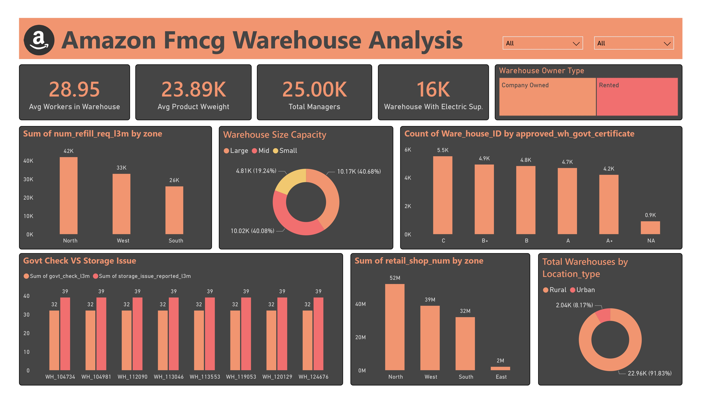
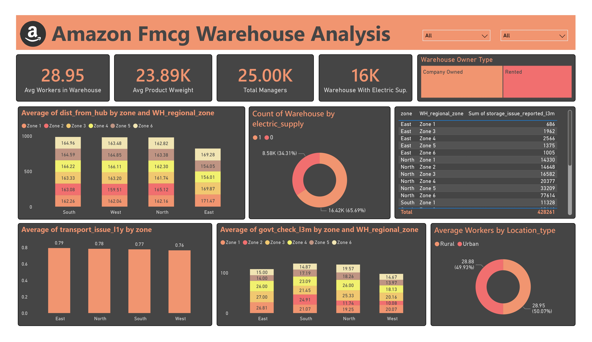

# **FMCG Warehouse: Optimizing Amazon's Distribution Efficiency**

## **Project Overview**
This project involves analyzing data from Amazon's network of warehouses to identify inefficiencies affecting the supply chain. These inefficiencies have led to frequent stockouts, delivery delays, and increased operational costs. As a Data Analyst, the goal is to uncover the root causes and provide actionable insights to improve overall warehouse efficiency.

### **Problem Statement**
Amazon is experiencing inefficiencies in its warehouse operations, leading to:
- Stockouts and unfulfilled customer orders
- Delays in deliveries to customers
- Increased operational and transportation costs

Your task is to analyze warehouse data, identify key performance indicators (KPIs), and propose data-driven solutions to optimize warehouse performance.

### **Why is it Important?**
Solving this problem will:
- Enhance customer satisfaction through timely deliveries
- Reduce operational and transportation costs
- Improve warehouse productivity and ensure a competitive advantage in the market

## **Stakeholders**
- **Internal Stakeholders**: Warehouse Managers, Supply Chain Analysts, Operations Team, Senior Management
- **External Stakeholders**: Retail Partners, Customers, Logistics Providers

## **Data Overview**
This project uses warehouse data, which includes critical information on warehouse capacity, refill requests, transport issues, competitor presence, and more. The dataset helps in analyzing operational efficiency and identifying problem areas.

- **Data Source**: [Supply Chain Optimization for an FMCG Company](https://www.kaggle.com/datasets/suraj9727/supply-chain-optimization-for-a-fmcg-company)

## **Project Workflow**
1. **Data Understanding**: Familiarizing with the dataset and understanding the warehouse attributes and key operational parameters.
2. **Data Cleaning**: Handling missing values and ensuring data consistency for accurate analysis.
3. **Exploratory Data Analysis (EDA)**: 
   - Analyzing warehouse size, geographical zones, and number of refill requests.
   - Examining transport issues, competitor presence, and storage capacity.
4. **Metric Development**: Key performance metrics include:
   - **Stockout Rate**: Percentage of stockouts per warehouse
   - **Delivery Delay Frequency**: Average delays in deliveries
   - **Operational Cost per Unit**: Cost to maintain each warehouse per unit of product
5. **Visualization**: Created interactive dashboards using Power BI for:
   - Warehouse capacity and utilization
   - Transport issues by zone
   - Number of retail shops served by each warehouse
   - Government checks and warehouse issues
6. **Insights and Recommendations**:
   - Optimize refill schedules for high-demand zones.
   - Improve transport logistics in zones with frequent delivery issues.
   - Enhance storage conditions for regions reporting frequent storage issues.
7. **Final Report**: Summarizing findings and presenting to the management team with proposed actionable insights.

## **Key Insights**
- **North Zone** had the highest number of retail shops and refill requests, suggesting it is a critical operational zone.
- **East Zone** faced the highest number of transport issues, indicating a need for logistics improvement.
- Warehouses in **rural locations** comprised over 90% of the network, showing a focus on lower-cost operations.
- Government inspections were frequent but storage issues remained low, indicating a balance between compliance and operational efficiency.

## **Tools and Technologies Used**
- **Python**: For data cleaning and exploratory data analysis (EDA)
- **Pandas & NumPy**: For data manipulation
- **Power BI**: For interactive data visualization and reporting
- **Matplotlib & Seaborn**: For generating custom data plots

## **Conclusion**
By analyzing Amazon’s FMCG warehouse data, several key inefficiencies were identified in warehouse operations and transport logistics. The insights generated from this analysis can be used to optimize refill schedules, improve storage conditions, and enhance transport logistics to minimize costs and delays.
